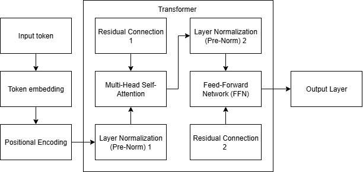

# Implementasi Transformer dengan NumPy

Proyek ini berisi implementasi arsitektur *decoder-only Transformer* (GPT *style*) dari nol (*from scratch*) hanya menggunakan library NumPy. Implementasi ini mencakup alur *forward pass*, mulai dari embedding hingga menghasilkan distribusi probabilitas untuk prediksi token berikutnya.

---

## 🏛️ Arsitektur

Proyek ini mengimplementasikan arsitektur **decoder-only Transformer** dengan skema **Pre-Normalization (Pre-Norm)**. Diagram di bawah ini memberikan gambaran umum alur data.



Secara lebih detail, alur di dalam setiap Blok Transformer pada kode yang diimplementasikan adalah sebagai berikut:

1.  **Input `x`** dari lapisan sebelumnya masuk.
2.  **Add & Norm Pertama:**
    * `x` dinormalisasi terlebih dahulu: `x_norm = LayerNorm(x)`.
    * Hasil normalisasi dilewatkan ke Multi-Head Attention: `attention_output = MultiHeadAttention(x_norm)`.
    * Output dari attention ditambahkan kembali ke input asli (*Residual Connection*): `x = x + attention_output`.
3.  **Add & Norm Kedua:**
    * `x` dari langkah sebelumnya dinormalisasi lagi: `x_norm = LayerNorm(x)`.
    * Hasil normalisasi dilewatkan ke Feed-Forward Network: `ffn_output = FFN(x_norm)`.
    * Output dari FFN ditambahkan kembali (*Residual Connection*): `x = x + ffn_output`.
4.  **Output `x`** yang sudah diperkaya konteksnya dikirim ke blok selanjutnya atau ke *Output Layer*.

---

## 📂 Struktur Proyek
```bash
Struktur direktori proyek ini dirancang agar modular dan mudah dipahami.
├── components/
│   ├── attention.py       # Multi-Head Attention
│   ├── embedding.py       # Token Embedding & Positional Encoding
│   ├── layers.py          # Feed-Forward Network & Layer Normalization
│   └── utils.py           # Fungsi bantuan (softmax dan causal_mask)
├── .gitignore             
├── main.py                # Skrip utama untuk menjalankan forward pass
└── transformer.ipynb      # Notebook untuk development dan visualisasi
```

## ✅ Komponen yang Diimplementasikan

Proyek ini telah mengimplementasikan komponen-komponen berikut :
1.  Token Embedding
2.  Positional Encoding (Sinusoidal)
3.  Scaled Dot-Product Attention
4.  Multi-Head Attention
5.  Feed-Forward Network (FFN)
6.  Residual Connection + Layer Normalization (Pre-Norm)
7.  Causal Masking
8.  Output Layer (Proyeksi Logits + Softmax)


## ▶️ Cara Menjalankan

1. Clone repositori ini dengan menjalankan perintah
```bash
git clone https://github.com/nashatr4/transformer-from-scratch.git
```
2. Install library (dependensi) yang dibutuhkan
```bash
pip install  numpy matplotlib 
```
Setelah instalasi selesai, ada dua cara untuk menjalankan kode ini.

### **Opsi 1: Menjalankan Skrip Python (main.py)**
Digunakan untuk verifikasi cepat alur forward pass dan melihat hasil pengecekan dimensi di terminal.

1. Buka terminal di direktori utama proyek.  
2. Jalankan perintah berikut:  

```bash
python main.py
```

### **Opsi 2: Menggunakan Jupyter Notebook**
Digunakan untuk eksplorasi interaktif, pemahaman mendalam, dan melihat visualisasi. 
1. Pastikan Anda sudah menginstal Jupyter Notebook atau menggunakan editor kode yang mendukungnya (misalnya VS Code).
2. Buka file `transformer.ipynb.`
3. Jalankan setiap sel kode secara berurutan dari atas ke bawah.

## 📋 Bukti Uji

Output dari `main.py` atau `transformer.ipynb` akan menunjukkan bukti uji seperti hasil masking, pengecekan dimensi, dan validasi softmax.
### **Output Uji Masking**
```bash
[[  0. -inf -inf -inf -inf -inf -inf -inf -inf -inf]
 [  0.   0. -inf -inf -inf -inf -inf -inf -inf -inf]
 [  0.   0.   0. -inf -inf -inf -inf -inf -inf -inf]
 [  0.   0.   0.   0. -inf -inf -inf -inf -inf -inf]
 [  0.   0.   0.   0.   0. -inf -inf -inf -inf -inf]
 [  0.   0.   0.   0.   0.   0. -inf -inf -inf -inf]
 [  0.   0.   0.   0.   0.   0.   0. -inf -inf -inf]
 [  0.   0.   0.   0.   0.   0.   0.   0. -inf -inf]
 [  0.   0.   0.   0.   0.   0.   0.   0.   0. -inf]
 [  0.   0.   0.   0.   0.   0.   0.   0.   0.   0.]]
```

### **Output Pengecekan Dimensi**
```bash
Bentuk Input Tokens: (2, 10)

Bentuk setelah Embedding & Positional Encoding: (2, 10, 512)
Bentuk setelah Multi-Head Attention: (2, 10, 512)
Bentuk setelah Feed-Forward Network: (2, 10, 512)

Bentuk Logits Akhir: (2, 10, 1000)
Bentuk Probabilitas Akhir: (2, 10, 1000)
```

### **Output Validasi Softmax**
```bash
Total Probabilitas untuk sekuens ke-1: 1.0
Total Probabilitas untuk sekuens ke-2: 1.0000000000000002
```